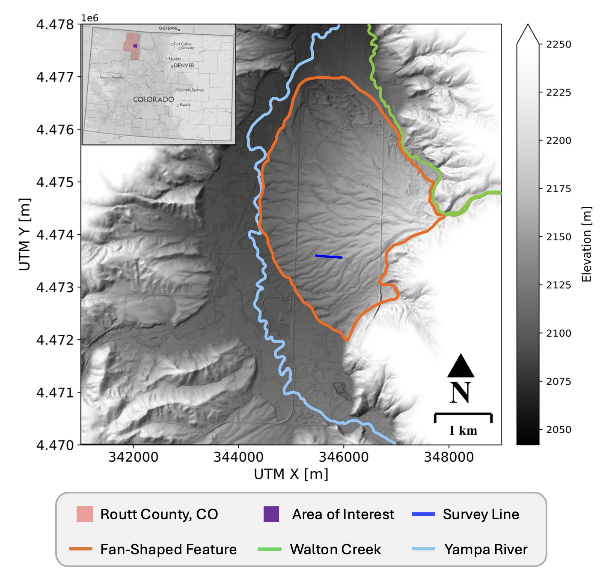
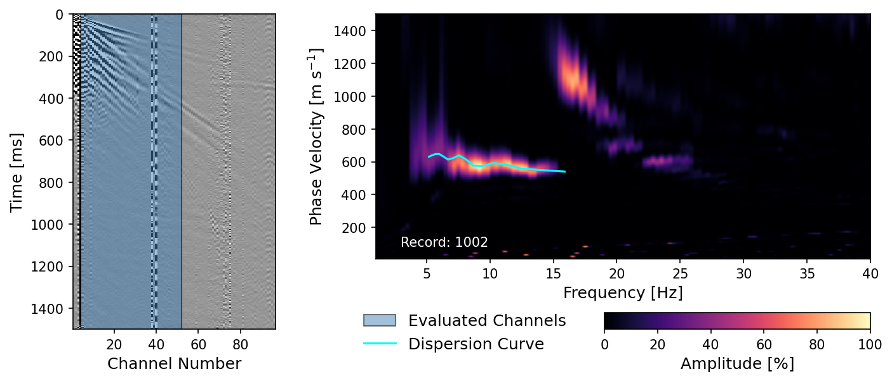
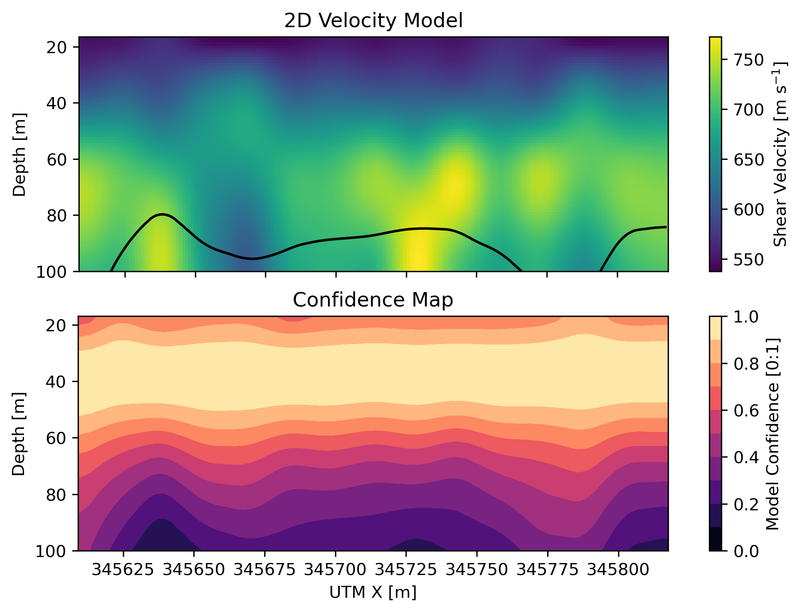

## Characterization of Glacial Sediment using MASW

MASW (Multichannel Analysis of Surface Waves) allows us to characterize deep into the subsurface. 

## Survey Area

Our survey was in the Yampa River Valley of Routt County, Colorado. From a DEM, we were able to identify a fan shaped feature coming from the Walton Creek Canyon.

## Generation of Dispersion Curves

Sythetic roll-along survey of 48 channels.

## 2D Velocity Model

Two dimensional velocity model created by inverting all 15 inversion curves.

## Final Abstract

For more information about data collection, processing, and interpretation of results, see our [abstract](../../masw-abstract.pdf).
