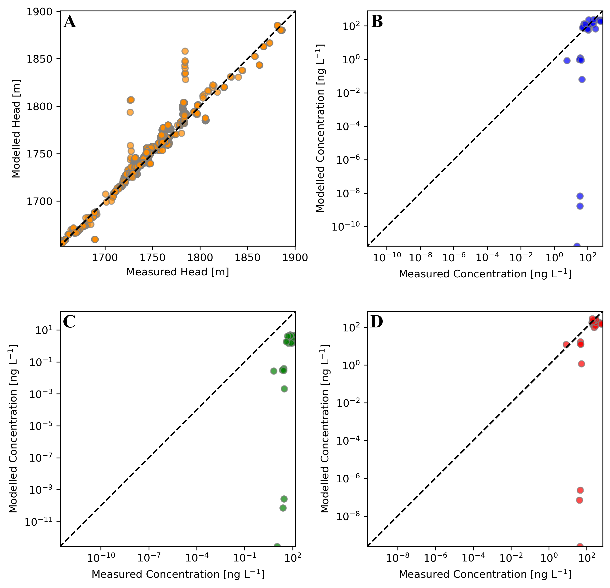

# Groundwater Modeling of PFAS Transport

Modeling the flow and transport of forever chemicals in Colorado Springs, CO. PFAS were introduced to the groundwater through AFFF firefighting foam from training events. Once they entered the water table, they started to flow downstream, where they reached the drinking wells in Fountain, CO. 

## Building the Flow and Transport Model

For this project, we used MODFLOW 6 to build the flow and transport models. The model domain consists of 30 concentration observations for PFOS, PFOA, and PFHxS. The inactive domain corresponds with the bedrock of the region.

We evaluated 446 stress periods from January 1, 1970 to January 1, 2020. We used a loading scenario generated from a HYDRUS vadose zone model.

## Model Results

The plume manages to reach Fountain in the observed timeframe, but the magnitudes were significantly under simulated further downstream.

The modeled vs simulated plots:

## Model Calibration

After generating results, we calibrated the model to our observations using iterative ensemble smoothing (IES). 

## Project Code

See the [repository](https://github.com/jackplogan33/peterson-modflow) for more information about the model and calibration steps.
